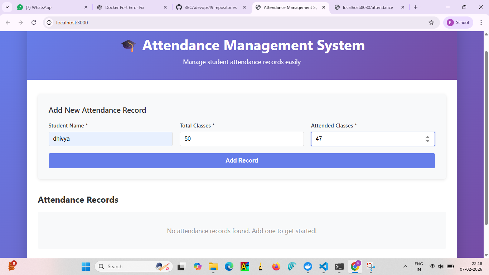
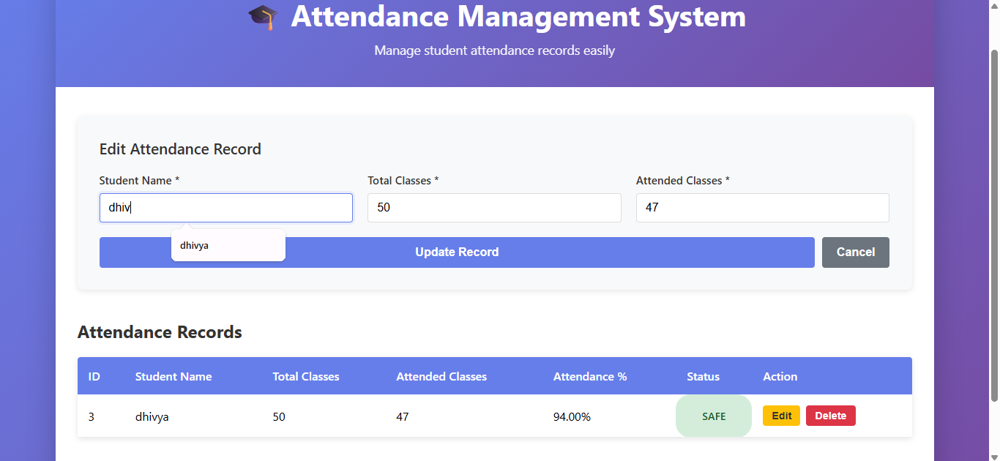
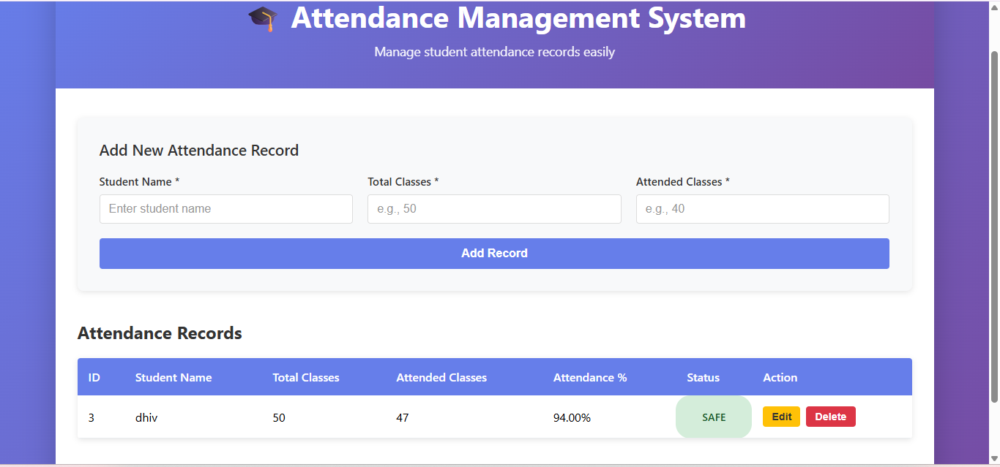
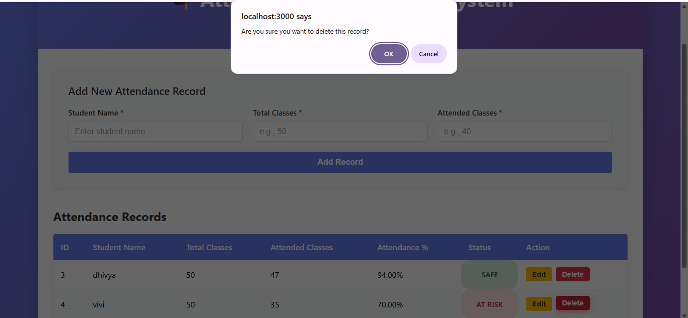
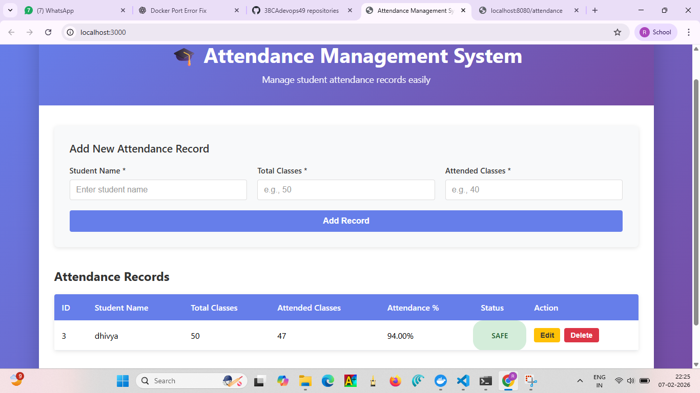

# Attendance Management System - React Frontend

A modern, responsive React application for efficiently managing student attendance records. Built with React 18.2.0 and Axios, this frontend seamlessly integrates with a Spring Boot backend API to provide a complete attendance management solution.

---

## 📋 Project Summary

The Attendance Management System is a full-stack web application designed to streamline attendance tracking and management. This React frontend provides an intuitive user interface for performing complete CRUD (Create, Read, Update, Delete) operations on student attendance records. The application automatically calculates attendance percentages and status, making it easy to monitor student attendance at a glance.

---

## 🎯 About the Project

The Attendance Management System serves as a practical solution for educational institutions looking to digitize their attendance tracking processes. The application provides:

- **Student-Centric Tracking**: Manage attendance for multiple students with ease
- **Real-time Calculations**: Automatic percentage and status updates based on attendance data
- **Data Integrity**: Secure communication with backend API ensuring data consistency
- **User-Friendly Interface**: Intuitive UI designed for quick and efficient data entry
- **Comprehensive Record Management**: Full CRUD capability for complete data lifecycle management

This project demonstrates modern React development practices including component composition, state management, async operations, and API integration.

---

## 🔧 Project Needs & Requirements

### Functional Requirements
- ✅ Create new attendance records with student information
- ✅ Read and display all attendance records in an organized table format
- ✅ Update existing records with new attendance data
- ✅ Delete records that are no longer needed
- ✅ Automatic calculation of attendance percentage
- ✅ Real-time status determination (Present/Absent)

### Technical Requirements
- Node.js v14+ environment
- React 18.2.0 for component-based UI
- Axios for API communication
- CSS3 for responsive styling
- Spring Boot backend API running on port 8080

### Non-Functional Requirements
- Responsive design for all device sizes
- Fast load times and smooth user interactions
- Error handling and user feedback
- Data validation before submission

---

## 📸 Screenshots

### 1. **Add Attendance Record**

*Creating a new student attendance record with automatic calculations*

### 2. **Read Attendance Records**

*Viewing all attendance records in a comprehensive table format*

### 3. **Update Attendance Record**

*Editing existing attendance information*

### 4. **Record Updated**

*Confirmation of successful record update*

### 5. **Delete Attendance Record**

*Removing attendance records with confirmation*

### 6. **Deletion Confirmed**

*Confirmation of successful record deletion*

---

## ✨ Features

- **Add Attendance Records**: Create new student attendance entries with automatic calculations
- **View All Records**: Display attendance records in a responsive, sortable table
- **Edit Records**: Modify existing attendance information seamlessly
- **Delete Records**: Remove records with confirmation to prevent accidental deletion
- **Status Tracking**: Automatically calculates percentage and status (Present if ≥ 75%, Absent otherwise)
- **Responsive Design**: Optimized for desktop, tablet, and mobile devices
- **Real-time Validation**: Immediate feedback on form inputs and data quality
- **Error Handling**: Graceful error messages and user notifications

---

## 📊 Data Structure

The application manages attendance records with the following properties:

| Field | Type | Description |
|-------|------|-------------|
| `id` | Integer | Unique identifier (auto-generated) |
| `studentName` | String | Name of the student |
| `totalClasses` | Integer | Total number of classes conducted |
| `attendedClasses` | Integer | Number of classes attended |
| `percentage` | Double | Calculated attendance percentage (0-100) |
| `status` | String | Attendance status: Present (≥75%) or Absent (<75%) |

---

## 🚀 Getting Started

### Prerequisites

- Node.js (v14 or higher)
- npm or yarn package manager
- Spring Boot backend running on `http://localhost:8080`

### Installation

1. Clone the repository:
```bash
git clone <repository-url>
cd attendance-react
```

2. Install dependencies:
```bash
npm install
```

### Configuration

The application communicates with the backend API at `http://localhost:8080` (configured in `package.json`):

```json
"proxy": "http://localhost:8080"
```

**Note:** If your backend runs on a different URL, update the proxy configuration in `package.json`.

### Running the Application

Start the development server:

```bash
npm start
```

The application will automatically open at `http://localhost:3000`.

---

## 📝 Available Scripts

| Script | Purpose |
|--------|---------|
| `npm start` | Runs the app in development mode with hot reload |
| `npm build` | Builds the app for production deployment |
| `npm test` | Runs the test suite |
| `npm eject` | Ejects configuration (one-way operation - use with caution) |

---

## 🔌 API Endpoints

The frontend communicates with the following backend endpoints:

```
GET    /attendance       → Retrieve all attendance records
POST   /attendance       → Create a new attendance record
PUT    /attendance/{id}  → Update an existing attendance record
DELETE /attendance/{id}  → Delete an attendance record
```

---

## 📂 Project Structure

```
src/
├── components/
│   ├── AttendanceForm.js       # Form component for adding/editing records
│   └── AttendanceTable.js      # Table component for displaying records
├── services/
│   └── attendanceService.js    # API service layer with axios client
├── styles/
│   ├── App.css                 # Main application styles
│   ├── AttendanceForm.css      # Form styling
│   ├── AttendanceTable.css     # Table styling
│   └── index.css               # Global styles
├── App.js                      # Root component with state management
├── index.js                    # React application entry point
└── index.css                   # Global CSS imports
```

---

## 🛠️ Technologies Used

| Technology | Version | Purpose |
|-----------|---------|---------|
| React | 18.2.0 | UI library and component framework |
| React DOM | 18.2.0 | React rendering for web |
| Axios | 1.6.0 | HTTP client for API requests |
| React Scripts | 5.0.1 | Build tools and webpack configuration |

---

## 🤝 Contributing

Contributions are welcome! Please feel free to submit pull requests or open issues for bugs and feature requests.

---

## 📄 License

This project is part of an educational attendance management system.

---

## 📧 Support

For issues, questions, or suggestions, please contact the development team or open an issue in the repository.
- CSS3 for styling
- React Scripts for tooling

## Styling

The application uses a modern gradient design with:
- Purple gradient header (`#667eea` to `#764ba2`)
- Clean, responsive layout
- Color-coded status badges
- Smooth transitions and hover effects

## Browser Support

- Chrome (latest)
- Firefox (latest)
- Safari (latest)
- Edge (latest)

## Troubleshooting

### Backend Connection Issues
If you see errors connecting to the backend:
1. Ensure the Spring Boot application is running on `http://localhost:8080`
2. Check network connectivity
3. Verify CORS is enabled on the backend if running on different ports

### Port Already in Use
If port 3000 is already in use:
```bash
npm start -- --port 3001
```

## License

This project is licensed under the MIT License.

## Support

For issues or questions, please contact the development team.
