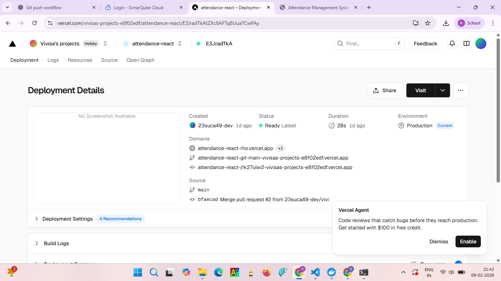
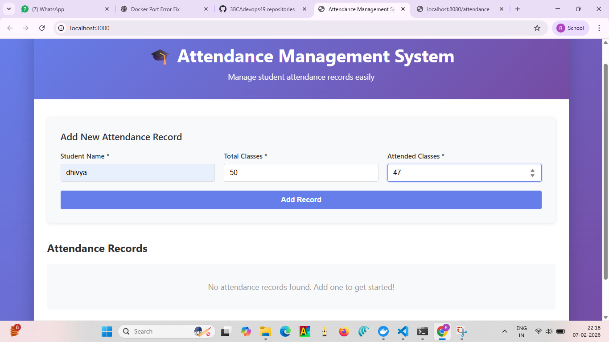
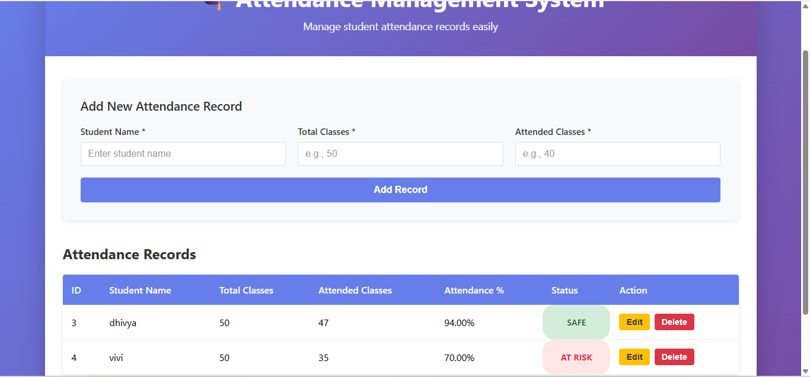
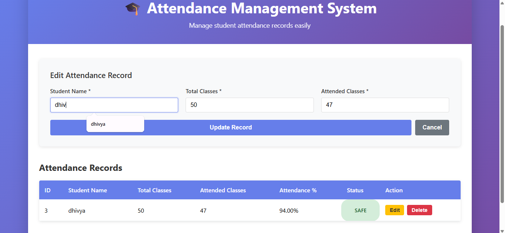
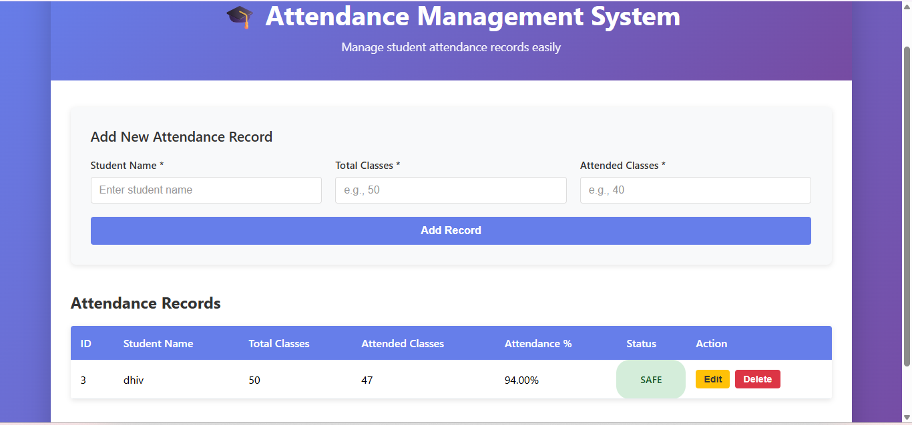
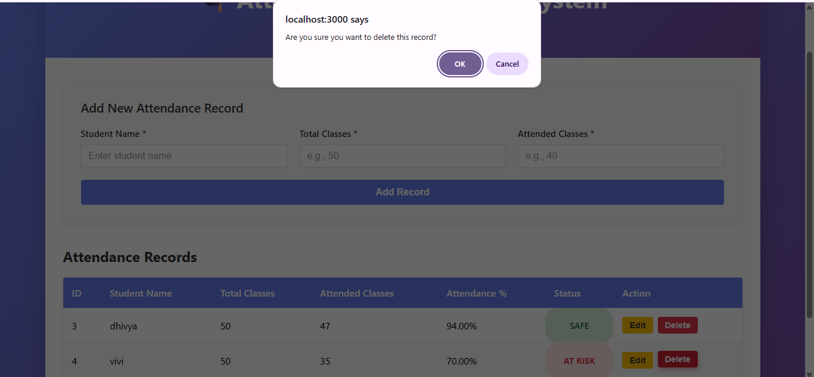
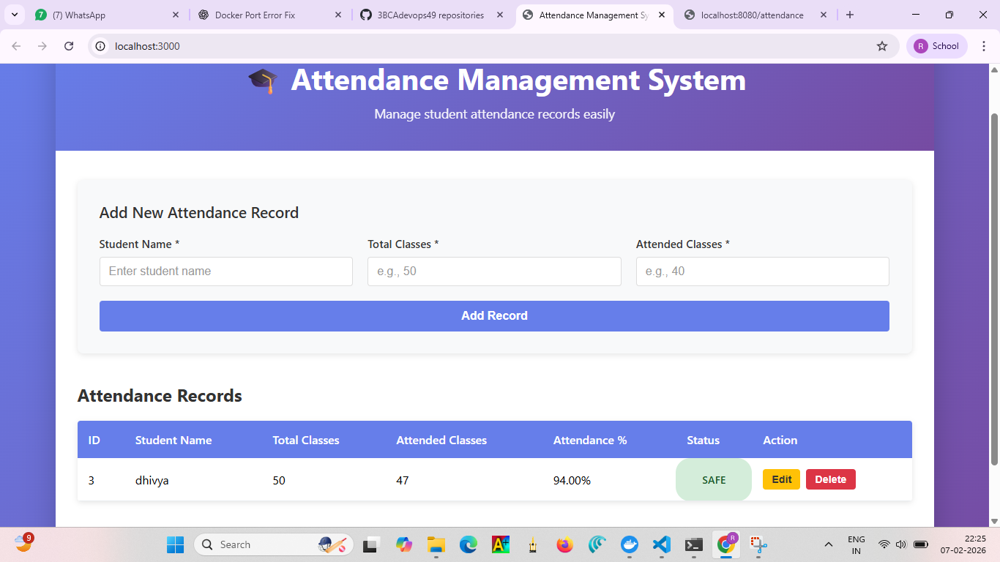

# 🎯 Attendance Risk Predictor - React Frontend

<div align="center">


**A powerful, intelligent attendance tracking system with risk prediction and automated status monitoring**

[Live Demo](https://attendanceriskpredictor-g6a4e6acekbrakh0.southeastasia-01.azurewebsites.net) • [Report Bug](../../issues) • [Request Feature](../../issues)

</div>

---

## 📋 Table of Contents

- [About the Project](#-about-the-project)
- [Key Features](#-key-features)
- [Screenshots](#-screenshots)
- [Tech Stack](#-tech-stack)
- [Getting Started](#-getting-started)
- [Usage Guide](#-usage-guide)
- [Risk Prediction Logic](#-risk-prediction-logic)
- [API Integration](#-api-integration)
- [Project Structure](#-project-structure)
- [Deployment](#-deployment)
- [Contributing](#-contributing)
- [License](#-license)
- [Contact](#-contact)

---

## 📖 About the Project

### Project Summary

The **Attendance Risk Predictor** is an intelligent, data-driven web application designed to revolutionize how educational institutions monitor and manage student attendance. Beyond traditional attendance tracking, this system employs predictive analytics to identify students at risk of poor attendance, enabling proactive interventions before attendance becomes a critical issue.

Built with modern React 18 and integrated with a robust Spring Boot backend, the application provides real-time attendance monitoring, automatic risk assessment, and comprehensive CRUD operations—all through an intuitive, user-friendly interface.

### 🎯 Problem Statement

Educational institutions face significant challenges in monitoring student attendance:
- **Reactive Approach**: Problems are identified only after attendance drops critically low
- **Manual Tracking**: Time-consuming manual calculations and status updates
- **Lack of Insights**: No predictive indicators to prevent attendance issues
- **Data Fragmentation**: Scattered records making analysis difficult

### 💡 Our Solution

The Attendance Risk Predictor addresses these challenges by:

✅ **Predictive Analytics** - Automatically identifies students at risk based on attendance patterns  
✅ **Real-Time Monitoring** - Instant status updates with color-coded risk indicators  
✅ **Automated Calculations** - Zero manual computation for percentages and status  
✅ **Centralized System** - Single platform for all attendance management needs  
✅ **Proactive Alerts** - Early warning system for intervention opportunities  
✅ **Data-Driven Decisions** - Visual insights for better administrative planning  

### 🌟 Why This Project Matters

- **Improves Student Success**: Early identification of at-risk students enables timely support
- **Saves Time**: Automated tracking eliminates hours of manual calculation
- **Enhances Accountability**: Transparent, real-time attendance visibility
- **Data Integrity**: Secure, centralized data storage with comprehensive audit trail
- **Scalable Solution**: Handles attendance for institutions of any size

### 🔑 Key Capabilities

| Feature | Description |
|---------|-------------|
| **Risk Assessment** | Automatic categorization: Safe (≥75%), At Risk (<75%) |
| **Smart CRUD** | Create, Read, Update, Delete with instant calculations |
| **Visual Indicators** | Color-coded status badges for quick identification |
| **Responsive Design** | Seamless experience across all devices |
| **Real-Time Sync** | Live updates with backend API integration |
| **Error Handling** | Robust validation and user-friendly error messages |

---

## ✨ Key Features

### 🎯 Core Functionality

#### 1. Intelligent Risk Prediction
- **Two-Tier Status System**:
   - 🟢 **Safe** (≥75%): Students meeting attendance requirements
   - 🔴 **At Risk** (<75%): Critical intervention needed
  
- **Automatic Categorization**: System automatically assigns risk levels based on attendance percentage
- **Visual Alerts**: Color-coded badges for instant identification of at-risk students

#### 2. Complete CRUD Operations
- ✏️ **Create**: Add new student records with automatic percentage calculation
- 👁️ **Read**: View all records in organized, filterable tables
- 🔄 **Update**: Modify existing records with real-time recalculation
- 🗑️ **Delete**: Remove records with confirmation dialogs

#### 3. Real-Time Analytics
- Instant percentage calculations: `(Attended Classes / Total Classes) × 100`
- Automatic status determination based on predefined thresholds
- Live data synchronization with backend API
- Dynamic UI updates without page refresh

### 🎨 User Experience

- **Intuitive Interface**: Clean, modern design with purple gradient theme
- **Responsive Layout**: Fully optimized for mobile, tablet, and desktop
- **Form Validation**: Real-time input validation and error messages
- **Loading States**: Visual feedback during API operations
- **Success Notifications**: Confirmation messages for all operations
- **Error Handling**: Graceful error management with user-friendly messages

### 🔧 Technical Features

- **Component-Based Architecture**: Modular, reusable React components
- **State Management**: Efficient React hooks for state handling
- **API Integration**: Axios-based RESTful API communication
- **Environment Configuration**: Configurable backend URL via .env
- **Error Boundaries**: Robust error handling and recovery
- **Code Quality**: Clean, maintainable, well-documented code

---

## 📸 Screenshots

<div align="center">

### 🔹 Application Overview

*Complete view of the Attendance Risk Predictor interface with risk indicators*

### 🔹 Add New Student Record

*Create new attendance records with automatic percentage and risk calculation*

### 🔹 View All Records

*Comprehensive table view with color-coded risk status for each student*

### 🔹 Update Student Record

*Edit existing attendance data with pre-filled forms and live calculations*

### 🔹 Update Confirmation

*Successful record update with immediate UI feedback and status change*

### 🔹 Delete Student Record

*Remove attendance records with safety confirmation dialog*

### 🔹 Delete Confirmation

*Confirmation of successful record deletion with updated table view*

</div>

---

## 🛠️ Tech Stack

### Frontend
- **React** `18.2.0` - Component-based UI library for building interactive interfaces
- **React DOM** `18.2.0` - React rendering for web applications
- **Axios** `1.6.0` - Promise-based HTTP client for API requests
- **React Scripts** `5.0.1` - Build configuration and development tools

### Styling & Design
- **CSS3** - Modern styling with gradients, animations, and transitions
- **Responsive Design** - Mobile-first approach with flexbox and grid
- **Custom Components** - Styled form and table components
- **Color-Coded System** - Visual risk indicators (Green/Red)

### Backend Integration
- **Spring Boot API** - RESTful backend service
- **CORS Enabled** - Cross-origin resource sharing for security
- **Deployed on Azure App Service** - Cloud-hosted backend at `https://attendanceriskpredictor-g6a4e6acekbrakh0.southeastasia-01.azurewebsites.net`

### Development Tools
- **Create React App** - Zero-configuration setup
- **npm** - Package management
- **Git** - Version control
- **VS Code** - Recommended IDE

---

## 🚀 Getting Started

### Prerequisites

Before you begin, ensure you have the following installed:

- **Node.js** (v14.0.0 or higher) - [Download](https://nodejs.org/)
- **npm** (v6.0.0 or higher) or **yarn** (v1.22.0 or higher)
- **Git** - [Download](https://git-scm.com/)

### Installation

1. **Clone the repository**
   ```bash
   git clone https://github.com/yourusername/attendance-risk-predictor.git
   cd attendance-risk-predictor
   ```

2. **Install dependencies**
   ```bash
   npm install
   ```
   or if you prefer yarn:
   ```bash
   yarn install
   ```

### Environment Setup

Create a `.env` file in the root directory:

```env
REACT_APP_API_URL=https://attendanceriskpredictor-g6a4e6acekbrakh0.southeastasia-01.azurewebsites.net
```

**Configuration Options:**

- **Production (Azure)**: `https://attendanceriskpredictor-g6a4e6acekbrakh0.southeastasia-01.azurewebsites.net`
- **Local Development**: `http://localhost:8080`

**Note:** Make sure your backend server is running and accessible before starting the frontend application.

### Running the Application

Start the development server:

```bash
npm start
```

The application will open automatically at **http://localhost:3000**

### Building for Production

Create an optimized production build:

```bash
npm run build
```

The build files will be generated in the `build/` directory, ready for deployment.

---

## 💻 Usage Guide

### Adding a New Record

1. Navigate to the **Attendance Form** at the top of the page
2. Enter the following information:
   - **Student Name**: Full name of the student
   - **Total Classes**: Total number of classes conducted
   - **Attended Classes**: Number of classes the student attended
3. The system automatically calculates:
   - **Percentage**: `(Attended / Total) × 100`
   - **Status**: Based on risk thresholds
4. Click **Add Attendance** to save the record
5. Success notification confirms the addition

### Viewing Records

- All records are displayed in the table below the form
- **Color-Coded Status Badges**:
   - 🟢 **Green (Safe)**: ≥75% - Meeting requirements
   - 🔴 **Red (At Risk)**: <75% - Critical intervention needed
- Records show: ID, Name, Total Classes, Attended Classes, Percentage, Status, Actions

### Updating a Record

1. Locate the student record you want to update
2. Click the **Edit** button in the Actions column
3. The form populates with current data
4. Modify the desired fields
5. Percentage and status recalculate automatically
6. Click **Update Attendance** to save changes
7. Table updates immediately with new values

### Deleting a Record

1. Find the record you want to remove
2. Click the **Delete** button in the Actions column
3. Confirm deletion in the popup dialog
4. Record is permanently removed from the system
5. Success notification confirms deletion

### Understanding Risk Levels

| Status | Percentage Range | Indicator | Action Required |
|--------|-----------------|-----------|-----------------|
| **Safe** | ≥ 75% | 🟢 Green | No action needed |
| **At Risk** | < 75% | 🔴 Red | Immediate intervention required |

---

## 🧮 Risk Prediction Logic

### Calculation Formula

```javascript
Attendance Percentage = (Attended Classes / Total Classes) × 100
```

### Status Determination Algorithm

```javascript
if (percentage >= 75) {
   status = "Safe";  // Green indicator
} else {
   status = "At Risk";   // Red indicator
}
```

### Risk Assessment Matrix

| Attendance % | Status | Risk Level | Recommended Action |
|-------------|--------|------------|-------------------|
| 90-100% | Safe | Very Low | Continue monitoring |
| 75-89% | Safe | Low | Maintain attendance |
| 0-74% | At Risk | Critical | Immediate intervention |

### Predictive Insights

The system provides early warning signals:
- Students dropping below 75% trigger "At Risk" status
- Enables proactive support before critical failure
- Historical data helps identify attendance patterns
- Facilitates data-driven decision making

---

## 🔌 API Integration

The frontend communicates with the Spring Boot backend through RESTful APIs:

### Base URL

```javascript
Production: https://attendanceriskpredictor-g6a4e6acekbrakh0.southeastasia-01.azurewebsites.net
Development: http://localhost:8080
```

### API Endpoints

| Method | Endpoint | Description | Request Body | Response |
|--------|----------|-------------|--------------|----------|
| `GET` | `/attendance` | Fetch all records | - | Array of attendance objects |
| `GET` | `/attendance/{id}` | Fetch single record | - | Attendance object |
| `POST` | `/attendance` | Create new record | Attendance object | Created object with ID |
| `PUT` | `/attendance/{id}` | Update existing record | Attendance object | Updated object |
| `DELETE` | `/attendance/{id}` | Delete a record | - | Success status |

### Data Model

```javascript
{
  "id": 1,
  "studentName": "John Doe",
  "totalClasses": 100,
  "attendedClasses": 85,
  "percentage": 85.0,
   "status": "Safe"
}
```

### API Service Layer

Located in `services/attendanceService.js`:

```javascript
import axios from 'axios';

const DEFAULT_API_HOST = 'https://attendanceriskpredictor-g6a4e6acekbrakh0.southeastasia-01.azurewebsites.net';
const API_HOST = process.env.REACT_APP_API_URL || DEFAULT_API_HOST;
const API_BASE_URL = `${API_HOST}/attendance`;

export const getAttendanceAPI = {
   getAll: () => axios.get(API_BASE_URL),
   getById: (id) => axios.get(`${API_BASE_URL}/${id}`),
   create: (data) => axios.post(API_BASE_URL, data),
   update: (id, data) => axios.put(`${API_BASE_URL}/${id}`, data),
   delete: (id) => axios.delete(`${API_BASE_URL}/${id}`)
};
```

### Error Handling

The application handles various error scenarios:
- Network errors (server down)
- Validation errors (invalid input)
- Not found errors (record doesn't exist)
- Server errors (500, 503)

---

## 📂 Project Structure

```
attendance-risk-predictor/
│
├── public/
│   └── index.html                    # HTML template
│
├── src/
│   ├── components/
│   │   ├── AttendanceForm.js        # Form for add/edit operations
│   │   └── AttendanceTable.js       # Table for displaying records
│   │
│   ├── services/
│   │   └── attendanceService.js     # Axios API service layer
│   │
│   ├── styles/
│   │   ├── App.css                  # Main application styles
│   │   ├── AttendanceForm.css       # Form component styles
│   │   ├── AttendanceTable.css      # Table component styles
│   │   └── index.css                # Global styles
│   │
│   ├── App.js                        # Root component
│   ├── index.js                      # React entry point
│   └── index.css                     # CSS imports
│
├── screenshot/                       # Application screenshots
│   ├── add.png
│   ├── read.png
│   ├── update.png
│   ├── updated.png
│   ├── delete.png
│   ├── deleted.png
│   └── versal.png
│
├── .github/
│   └── workflows/
│       └── build.yml                 # CI/CD workflow
│
├── .env                              # Environment variables
├── .gitignore                        # Git ignore rules
├── package.json                      # Dependencies and scripts
├── sonar-project.properties          # SonarQube configuration
└── README.md                         # Project documentation
```

---

## 📜 Available Scripts

| Command | Description |
|---------|-------------|
| `npm start` | Runs app in development mode at http://localhost:3000 |
| `npm build` | Creates optimized production build in `build/` folder |
| `npm test` | Launches test runner in interactive watch mode |
| `npm eject` | Ejects from Create React App (⚠️ irreversible) |

---

## 🎨 Styling & Design System

### Color Palette

| Color | Hex Code | Usage |
|-------|----------|-------|
| Primary Gradient | `#667eea → #764ba2` | Header, buttons |
| Success (Safe) | `#28a745` | ≥75% attendance |
| Danger (At Risk) | `#dc3545` | <75% attendance |
| Background | `#f8f9fa` | Page background |
| Text Primary | `#333` | Main text |
| Text Secondary | `#666` | Secondary text |

### Design Principles

- **Clean & Modern**: Minimalist interface with focus on functionality
- **Visual Hierarchy**: Clear distinction between different elements
- **Accessibility**: High contrast ratios for readability
- **Consistency**: Uniform spacing, typography, and colors
- **Responsive**: Adapts seamlessly to all screen sizes

---

## 🚢 Deployment

### Deploy to Netlify

1. **Build the project**:
   ```bash
   npm run build
   ```

2. **Deploy using Netlify CLI**:
   ```bash
   npm install -g netlify-cli
   netlify deploy --prod
   ```

3. **Set environment variables** in Netlify dashboard:
   ```
   REACT_APP_API_URL=https://attendanceriskpredictor-g6a4e6acekbrakh0.southeastasia-01.azurewebsites.net
   ```

### Deploy to Vercel

1. **Install Vercel CLI**:
   ```bash
   npm install -g vercel
   ```

2. **Deploy**:
   ```bash
   vercel --prod
   ```

3. **Configure environment variables** in Vercel dashboard

### Deploy to GitHub Pages

1. **Add to package.json**:
   ```json
   "homepage": "https://yourusername.github.io/attendance-risk-predictor"
   ```

2. **Install gh-pages**:
   ```bash
   npm install --save-dev gh-pages
   ```

3. **Add scripts**:
   ```json
   "predeploy": "npm run build",
   "deploy": "gh-pages -d build"
   ```

4. **Deploy**:
   ```bash
   npm run deploy
   ```

---

## 🧪 Testing

### Run Tests

```bash
npm test
```

### Coverage Report

```bash
npm test -- --coverage
```

### Test Structure

- Unit tests for components
- Integration tests for API calls
- End-to-end tests for user flows

---

## 🤝 Contributing

Contributions make the open-source community an amazing place to learn and create. Any contributions you make are **greatly appreciated**!

### How to Contribute

1. **Fork the Project**
2. **Create your Feature Branch**
   ```bash
   git checkout -b feature/AmazingFeature
   ```
3. **Commit your Changes**
   ```bash
   git commit -m 'Add some AmazingFeature'
   ```
4. **Push to the Branch**
   ```bash
   git push origin feature/AmazingFeature
   ```
5. **Open a Pull Request**

### Coding Standards

- Follow React best practices and hooks guidelines
- Use functional components over class components
- Write clean, self-documenting code with comments
- Maintain consistent code formatting
- Test your changes thoroughly before submitting
- Update documentation for new features

### Commit Message Guidelines

- Use clear, descriptive commit messages
- Start with a verb (Add, Update, Fix, Remove)
- Keep the subject line under 50 characters
- Add detailed description if necessary

---

## 📝 License

This project is licensed under the **MIT License** - see the [LICENSE](LICENSE) file for details.

```
MIT License

Copyright (c) 2026 Attendance Risk Predictor Team

Permission is hereby granted, free of charge, to any person obtaining a copy
of this software and associated documentation files (the "Software"), to deal
in the Software without restriction, including without limitation the rights
to use, copy, modify, merge, publish, distribute, sublicense, and/or sell
copies of the Software, and to permit persons to whom the Software is
furnished to do so, subject to the following conditions:

The above copyright notice and this permission notice shall be included in all
copies or substantial portions of the Software.
```

---

## 📧 Contact

**Attendance Risk Predictor Team**

- 📧 **Email**: support@attendance-risk-predictor.com
- 🐛 **Issues**: [GitHub Issues](../../issues)
- 💬 **Discussions**: [GitHub Discussions](../../discussions)
- 📚 **Documentation**: [Wiki](../../wiki)

**Project Links**:
- **Repository**: [https://github.com/yourusername/attendance-risk-predictor](https://github.com/yourusername/attendance-risk-predictor)
- **Live Demo**: [https://attendanceriskpredictor-g6a4e6acekbrakh0.southeastasia-01.azurewebsites.net](https://attendanceriskpredictor-g6a4e6acekbrakh0.southeastasia-01.azurewebsites.net)
- **Backend API**: [Spring Boot Repository](https://github.com/yourusername/attendance-backend)

---

## 🙏 Acknowledgments

- [React Documentation](https://react.dev/) - Comprehensive React guides
- [Axios](https://axios-http.com/) - Promise-based HTTP client
- [Create React App](https://create-react-app.dev/) - Zero-config setup
- [Spring Boot](https://spring.io/projects/spring-boot) - Backend framework
- [Render](https://render.com/) - Cloud hosting platform
- [MDN Web Docs](https://developer.mozilla.org/) - Web development resources
- [Stack Overflow](https://stackoverflow.com/) - Community support

---

## 🔮 Future Enhancements

- [ ] Add authentication and user roles (Admin, Teacher, Student)
- [ ] Implement data visualization with charts and graphs
- [ ] Export attendance reports to PDF/Excel
- [ ] Send email/SMS notifications for at-risk students
- [ ] Add bulk upload feature for multiple records
- [ ] Implement advanced filtering and search
- [ ] Add attendance history and trends
- [ ] Mobile app version (React Native)
- [ ] Integration with Learning Management Systems (LMS)
- [ ] Machine learning for attendance pattern prediction

---

<div align="center">

### ⭐ Star this repository if you find it helpful!

**Made with ❤️ by the Attendance Risk Predictor Team**

[⬆ Back to Top](#-attendance-risk-predictor---react-frontend)

</div>

